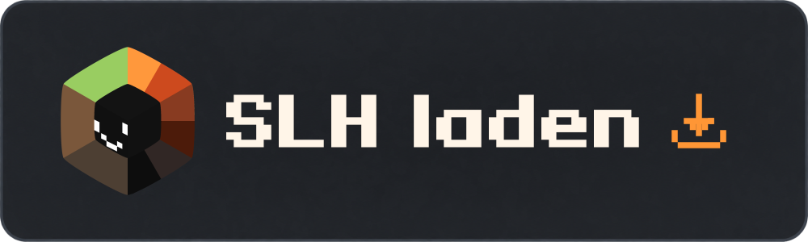
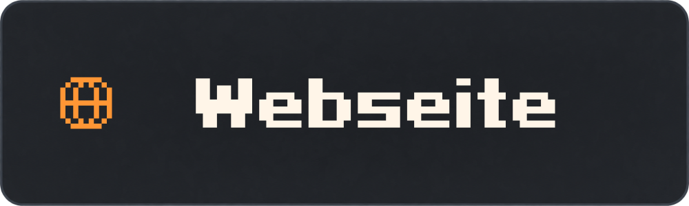
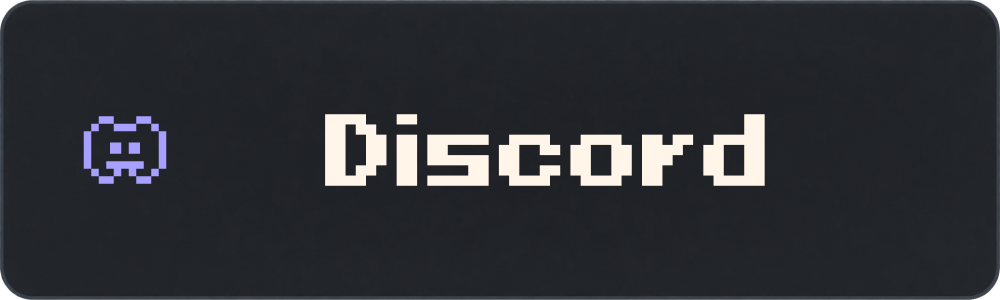
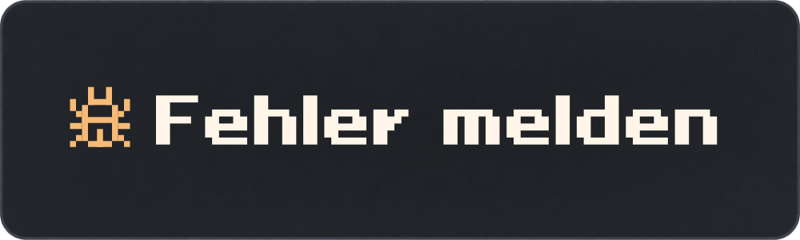
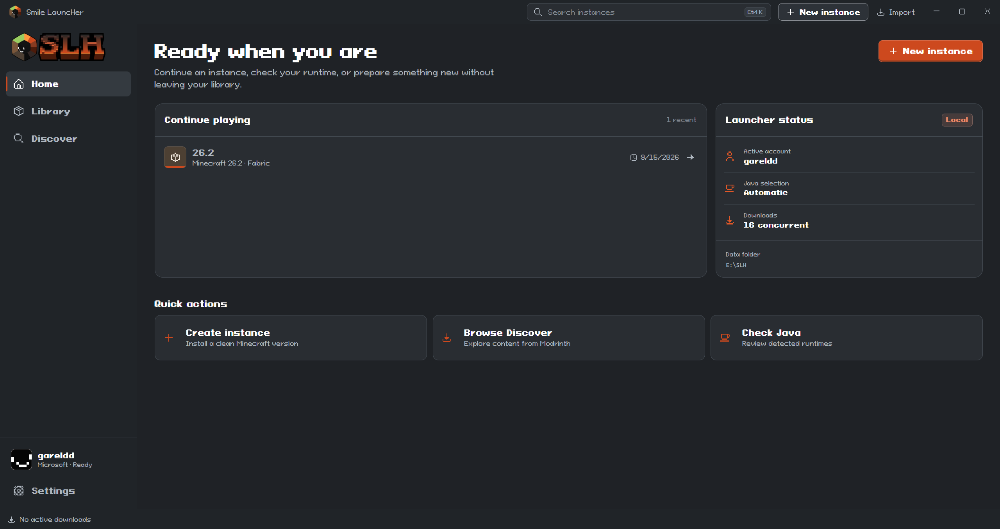
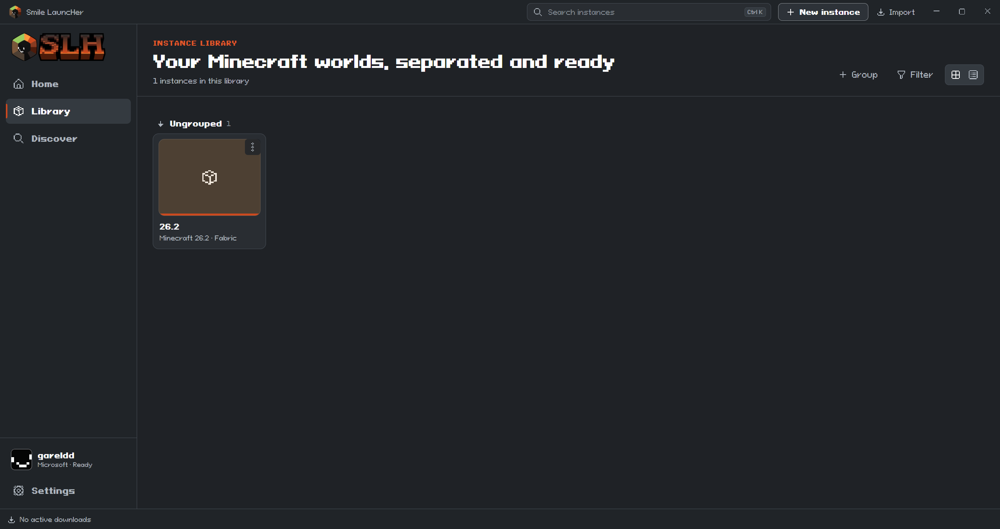
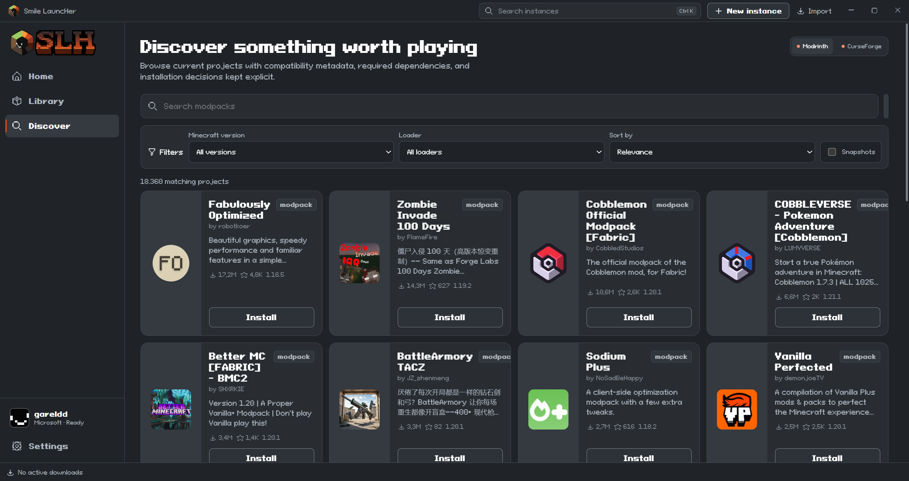
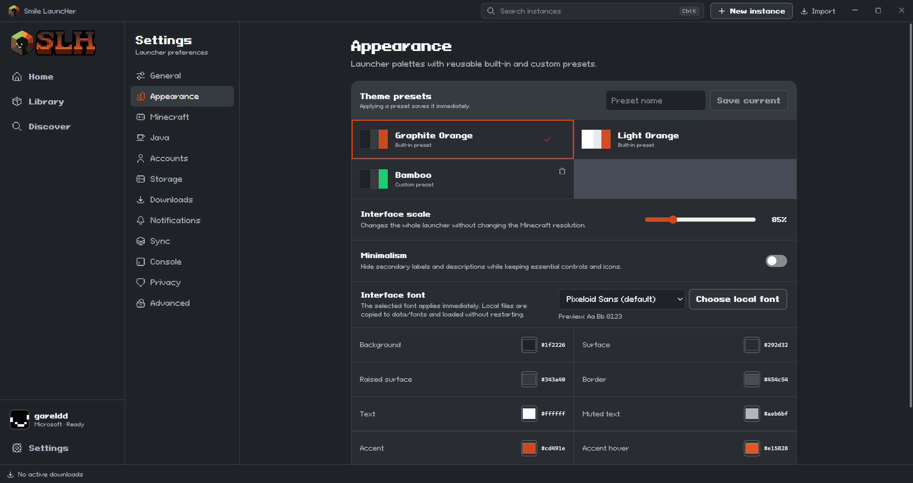

  

<h1 align="center">Smile LauncHer</h1>

<strong>Deine Instanzen. Deine Einstellungen. Dein Minecraft.</strong>

Minecraft Java Edition · Getrennte Instanzen · Mods und Modpacks · Anpassbare Oberfläche

  

  
  
  

  
  
  

<a href="README.md">Русский</a> · <a href="README.en.md">English</a> · <a href="README.de.md">Deutsch</a>

## Minecraft nach deinen Vorstellungen

SLH verbindet Spiel, Inhalte und Einstellungen in einem Launcher. Erstelle getrennte Instanzen, wähle einen Modloader und passe jede Installation an.

| | Funktionen |
| :--- | :--- |
| **Instanzen** | Getrennte Spielordner, Gruppen, Raster und Listen. Welten, Screenshots und Logs direkt beim Spiel. |
| **Modloader** | Vanilla, Fabric, Forge, NeoForge und Quilt. |
| **Inhalte** | Modrinth, Mods und Modpacks. CurseForge bei eingerichtetem Zugang. |
| **Konten** | Microsoft, Ely.by und Offlineprofile. Kontowechsel und Skinvorschau. |
| **Java** | Passende Java-Version herunterladen oder vorhandene Laufzeiten finden. |
| **Oberfläche** | Themes, Farben und Einstellungen. Russisch, Englisch und Deutsch enthalten. |
| **Lokale Daten** | Einstellungen und Spieldateien auf deinem Computer. Keine Werbung oder Analytik. |

## Ein Blick in den Launcher

<table>
  <tr>
    <td width="50%"><strong>Instanzenbibliothek</strong> </td>
    <td width="50%"><strong>Inhaltekatalog</strong> </td>
  </tr>
</table>

Weiterer Screenshot: Darstellungseinstellungen

[Interaktive Vorschau auf der SLH-Webseite](https://slhmc.github.io/#preview). Die Screenshots zeigen die aktuelle Entwicklungsoberfläche; veröffentlichte Versionen können abweichen. Die gezeigte Oberfläche ist englisch.

## Herunterladen und spielen

Offizielle Pakete findest du in [GitHub Releases](https://github.com/slhmc/slh/releases). Aktuell ist die Testversion [v0.1.2](https://github.com/slhmc/slh/releases/tag/v0.1.2) veröffentlicht.

| Plattform | Installer | Portable |
| :--- | :--- | :--- |
| **Windows 10 x64** | [.exe herunterladen](https://github.com/slhmc/slh/releases/download/v0.1.2/SLH_0.1.2_win10x64-setup.exe) | [.zip herunterladen](https://github.com/slhmc/slh/releases/download/v0.1.2/portable-SLH_0.1.2_win10x64.zip) |
| **Windows 11 x64** | [.exe herunterladen](https://github.com/slhmc/slh/releases/download/v0.1.2/SLH_0.1.2_11winx64-setup.exe) | [.zip herunterladen](https://github.com/slhmc/slh/releases/download/v0.1.2/portable-SLH_0.1.2_win11x64.zip) |
| **macOS · Intel / Apple Silicon** | In Vorbereitung | In Vorbereitung |
| **Linux** | In Vorbereitung | In Vorbereitung |

**Installer:** Passendes Paket herunterladen, starten und dem Installationsassistenten folgen.

**Portable:** Das gesamte Archiv in einen beschreibbaren Ordner entpacken und `SLH.exe` starten. Beim Verschieben den vollständigen Ordner behalten.

SLH wird noch entwickelt. Sichere wichtige Welten vor dem Test einer neuen Version.

## Häufige Fragen

<strong>Muss ich Java selbst installieren?</strong>

SLH kann passende Java-Versionen herunterladen oder vorhandene Laufzeiten finden. Downloads benötigen Internetzugang.

<strong>Wie melde ich mich an?</strong>

Microsoft, Ely.by und Offlineprofile werden unterstützt. Für Microsoft benötigst du ein Konto mit Minecraft: Java Edition. Offlineprofile geben keinen Zugang zu Servern, die den Spielbesitz prüfen.

<strong>Wo liegen meine Daten?</strong>

Die Daten bleiben lokal. Portable-Versionen speichern `data/` neben dem Launcher. Veröffentliche diesen Ordner nicht: Er kann Konten, Tokens, Welten und Serverdaten enthalten. Auf einem anderen Computer kann eine erneute Anmeldung nötig sein. Siehe [PORTABLE.md](PORTABLE.md).

<strong>Was tun bei Problemen?</strong>

Besuche [Discord](https://discord.gg/yhTvuB6U8n) oder [erstelle ein Issue](https://github.com/slhmc/slh/issues/new). Gib SLH-Version, Betriebssystem, Reproduktionsschritte und erwartetes Verhalten an. Entferne persönliche Daten und Tokens aus Logs vor dem Hochladen.

## Code und Entwicklung

SLH nutzt **Tauri 2, React, TypeScript, Rust und SQLite**. Lizenz: [GPL-3.0-only](LICENSE).

**Die Veröffentlichung der Quellen wird vorbereitet.** Dieses Repository enthält derzeit Dokumentation, Bilder und Releases. Die vollständigen Quellen für eigene Builds folgen in einem separaten Update.

[Architektur](ARCHITECTURE.md) · [Entwicklung](DEVELOPMENT.md) · [Konten](AUTH.md) · [Sprachen](LANGUAGES.md) · [Portable](PORTABLE.md)

## Community

Fragen und Ideen sind in [Discord](https://discord.gg/yhTvuB6U8n) willkommen. Fehler und Vorschläge werden in [GitHub Issues](https://github.com/slhmc/slh/issues) gesammelt.

---

Smile LauncHer ist ein unabhängiges Projekt und nicht mit Mojang oder Microsoft verbunden. Minecraft gehört den jeweiligen Rechteinhabern.

