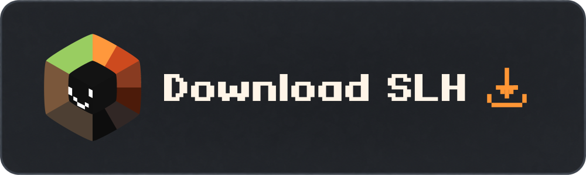
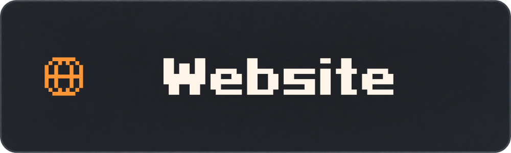
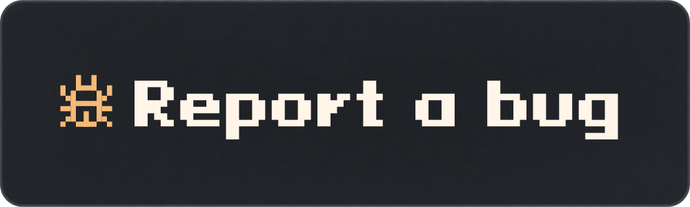

<p align="center">
  
</p>

<h1 align="center">Smile LauncHer</h1>
<p align="center"><strong>Your instances. Your settings. Your Minecraft.</strong></p>
<p align="center">Minecraft Java Edition · Separate instances · Mods and modpacks · A customizable interface</p>

<p align="center">
  <a href="https://github.com/slhmc/slh/releases/tag/v0.2.0"></a>
</p>
<p align="center">
  <a href="https://slhmc.github.io/"></a>
  <a href="https://discord.gg/yhTvuB6U8n"></a>
  <a href="https://github.com/slhmc/slh/issues/new"></a>
</p>

<p align="center">
  <a href="LICENSE"></a>
  
  
</p>

<p align="center"><a href="README.md">Русский</a> · <a href="README.en.md">English</a> · <a href="README.de.md">Deutsch</a></p>

<p align="center"></p>

## Make Minecraft your own

SLH brings your game, content and settings into one launcher. Create separate instances, choose a mod loader and tailor each installation to the way you play.

| | Features |
| :--- | :--- |
| **Instances** | Separate game folders, groups, grid and list views. Worlds, screenshots and logs alongside your game. |
| **Instance adaptation** | Create a copy for another Minecraft version. Choose folders and files to transfer, with separate update switches for mods, resource packs and shaders. Keep the original instance. |
| **Home screen** | A centered player character, skins, animations and rotation. Account controls, launcher status and the last played instance. |
| **Optimizations** | Less background work when minimized, 3D scene cleanup and cached skins and catalog results. |
| **Bedrock · W.I.P.** | Experimental support under development. Windows packages include the native helper. |
| **Loaders** | Vanilla, Fabric, Forge, NeoForge and Quilt. |
| **Content** | Modrinth browsing, mods and modpacks. CurseForge when access is configured. |
| **Accounts** | Microsoft, Ely.by and offline profiles. Account switching and skin previews. |
| **Java** | Select and download compatible Java, or detect installed runtimes. |
| **Appearance** | Themes, colors and interface settings. Russian, English and German included. |
| **Local data** | Settings and game files on your computer. No advertising or analytics. |

## Take a look inside

<table>
  <tr>
    <td width="50%"><strong>Instance library</strong><br></td>
    <td width="50%"><strong>Content catalog</strong><br></td>
  </tr>
</table>

<details>
<summary>Another screenshot: appearance settings</summary>

<p></p>

</details>

Explore the [interactive preview on the SLH website](https://slhmc.github.io/#preview). Screenshots show the current development interface; published releases may differ.

## Download and play

Try the [v0.2.0 pre-release](https://github.com/slhmc/slh/releases/tag/v0.2.0). Choose a package for your operating system.

> ⚠️ **Linux and macOS builds have not been manually tested.** All four desktop targets were built and passed unit tests, but launching SLH and Minecraft on Linux and macOS has not been verified.

| Platform | Installer / package | Portable / app archive |
| :--- | :--- | :--- |
| **🪟 Windows 10 / 11 · x64** | [EXE](https://github.com/slhmc/slh/releases/download/v0.2.0/SLH-0.2.0-x86_64-pc-windows-msvc-setup.exe) · [MSI](https://github.com/slhmc/slh/releases/download/v0.2.0/SLH-0.2.0-x86_64-pc-windows-msvc.msi) | [ZIP](https://github.com/slhmc/slh/releases/download/v0.2.0/SLH-0.2.0-x86_64-pc-windows-msvc-portable.zip) |
| **🍎 macOS · Intel · manually untested** | [DMG](https://github.com/slhmc/slh/releases/download/v0.2.0/SLH-0.2.0-x86_64-apple-darwin.dmg) | [App ZIP](https://github.com/slhmc/slh/releases/download/v0.2.0/SLH-0.2.0-x86_64-apple-darwin-app.zip) |
| **🍎 macOS · Apple Silicon · manually untested** | [DMG](https://github.com/slhmc/slh/releases/download/v0.2.0/SLH-0.2.0-aarch64-apple-darwin.dmg) | [App ZIP](https://github.com/slhmc/slh/releases/download/v0.2.0/SLH-0.2.0-aarch64-apple-darwin-app.zip) |
| **🐧 Linux · x64 · manually untested** | [DEB](https://github.com/slhmc/slh/releases/download/v0.2.0/SLH-0.2.0-x86_64-unknown-linux-gnu.deb) · [RPM](https://github.com/slhmc/slh/releases/download/v0.2.0/SLH-0.2.0-x86_64-unknown-linux-gnu.rpm) | [AppImage](https://github.com/slhmc/slh/releases/download/v0.2.0/SLH-0.2.0-x86_64-unknown-linux-gnu.AppImage) |

**Windows portable:** extract the entire ZIP into a writable folder and run `SLH.exe`. Keep the folder together when moving it.

Linux packages were built on Ubuntu 22.04; compatibility with every distribution is not guaranteed. Windows and Linux packages are unsigned; macOS packages are ad-hoc signed and not notarized.

Back up important worlds before testing or adapting an instance. [SHA-256 checksums](https://github.com/slhmc/slh/releases/download/v0.2.0/SHA256SUMS.txt).

## Frequently asked questions

<details>
<summary><strong>Do I need to install Java myself?</strong></summary>

SLH can select and download compatible Java or find installed runtimes. Downloads require internet access.

</details>

<details>
<summary><strong>How do I sign in?</strong></summary>

Microsoft, Ely.by and offline profiles are supported. Microsoft play requires an account entitled to Minecraft: Java Edition. Offline profiles do not grant access to servers that verify game ownership.

</details>

<details>
<summary><strong>Where is my data stored?</strong></summary>

Data stays local. Portable builds keep `data/` next to the launcher. Do not publish this folder: it may contain accounts, tokens, worlds and server details. Moving to another computer may require signing in again. See [PORTABLE.md](PORTABLE.md).

</details>

<details>
<summary><strong>Something is not working. What should I do?</strong></summary>

Visit [Discord](https://discord.gg/yhTvuB6U8n) or [open an issue](https://github.com/slhmc/slh/issues/new). Include your SLH version, operating system, steps to reproduce and expected behavior. Remove personal data and tokens before attaching logs.

</details>

## Code and development

SLH uses **Tauri 2, React, TypeScript, Rust and SQLite**, under [GPL-3.0-only](LICENSE).

The source is published under GPL-3.0-only, including the frontend, Rust core, resources, build scripts and pinned Bedrock submodule. Forks can override the public Microsoft client ID with `SLH_MICROSOFT_CLIENT_ID`.

```sh
git clone --recurse-submodules https://github.com/slhmc/slh.git
cd slh
npm ci
npm run tauri:dev
```

Windows builds with Bedrock also require Go. See [BUILDING.md](BUILDING.md).

[Architecture](ARCHITECTURE.md) · [Development](DEVELOPMENT.md) · [Accounts](AUTH.md) · [Languages](LANGUAGES.md) · [Portable storage](PORTABLE.md)

## Community

Questions and ideas are welcome in [Discord](https://discord.gg/yhTvuB6U8n). Track bugs and suggestions in [GitHub Issues](https://github.com/slhmc/slh/issues).

---

<p align="center"><sub>Smile LauncHer is an independent project and is not affiliated with Mojang or Microsoft. Minecraft belongs to its respective rights holders.</sub></p>
