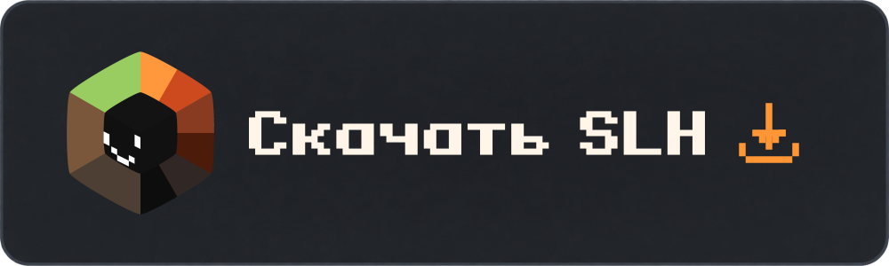
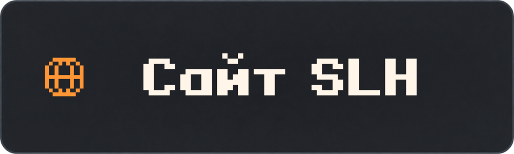
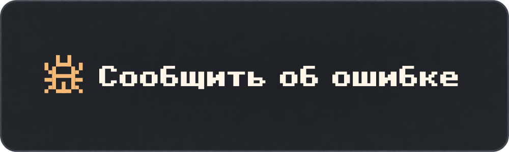
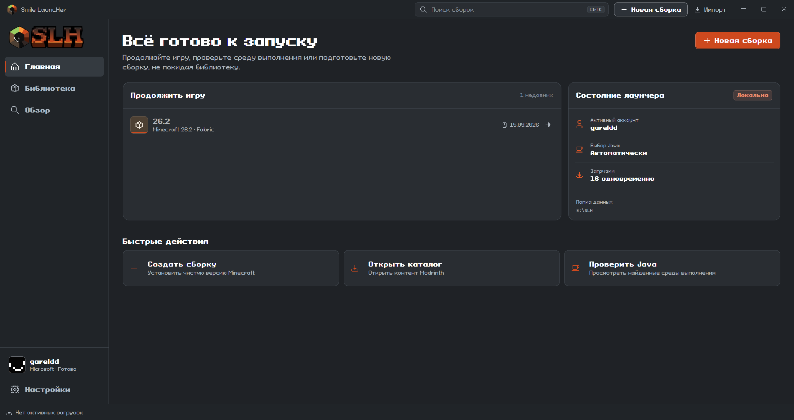
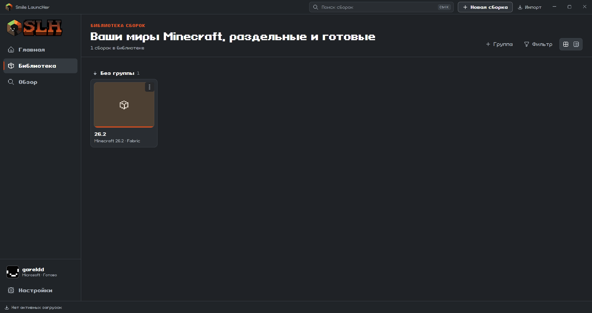
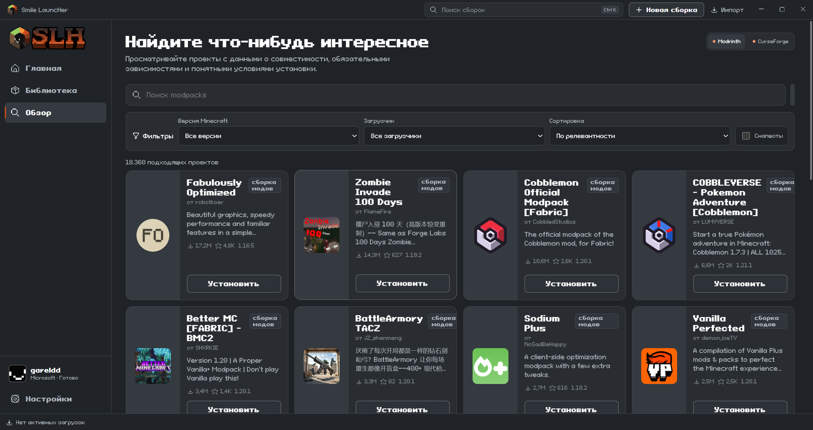
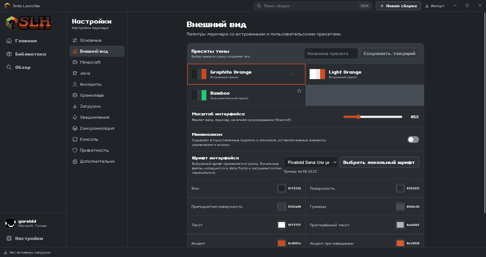

  

<h1 align="center">Smile LauncHer</h1>

<strong>Твои сборки. Твои настройки. Твой Minecraft.</strong>

Minecraft Java Edition · Отдельные сборки · Моды и модпаки · Настраиваемый интерфейс

  

  
  
  

  
  
  

<a href="README.md">Русский</a> · <a href="README.en.md">English</a> · <a href="README.de.md">Deutsch</a>

## Всё для твоего Minecraft

SLH объединяет игру, контент и настройки в одном лаунчере. Создавай отдельные сборки, выбирай загрузчик модов и настраивай каждую установку под себя.

| | Возможности |
| :--- | :--- |
| **Сборки** | Отдельные игровые папки, группы, сетка и список. Миры, скриншоты и логи рядом с игрой. |
| **Загрузчики** | Vanilla, Fabric, Forge, NeoForge и Quilt. |
| **Контент** | Каталог Modrinth, моды и модпаки. CurseForge — при настроенном доступе. |
| **Аккаунты** | Microsoft, Ely.by и офлайн-профили. Переключение аккаунтов и просмотр скинов. |
| **Java** | Подбор и загрузка подходящей Java, поиск уже установленных версий. |
| **Внешний вид** | Темы, цвета и настройки интерфейса. Русский, английский и немецкий языки. |
| **Локальные данные** | Настройки и игровые файлы на твоём компьютере. Без рекламы и аналитики. |

## Посмотри внутри

<table>
  <tr>
    <td width="50%"><strong>Библиотека сборок</strong> </td>
    <td width="50%"><strong>Каталог контента</strong> </td>
  </tr>
</table>

Ещё один скриншот: настройки внешнего вида

Полное интерактивное превью — [на сайте SLH](https://slhmc.github.io/#preview). Скриншоты показывают текущий интерфейс разработки; опубликованный релиз может отличаться.

## Скачать и начать играть

Готовые файлы находятся в [GitHub Releases](https://github.com/slhmc/slh/releases). Сейчас опубликована тестовая версия [v0.1.2](https://github.com/slhmc/slh/releases/tag/v0.1.2).

| Платформа | Установщик | Portable |
| :--- | :--- | :--- |
| **Windows 10 x64** | [Скачать .exe](https://github.com/slhmc/slh/releases/download/v0.1.2/SLH_0.1.2_win10x64-setup.exe) | [Скачать .zip](https://github.com/slhmc/slh/releases/download/v0.1.2/portable-SLH_0.1.2_win10x64.zip) |
| **Windows 11 x64** | [Скачать .exe](https://github.com/slhmc/slh/releases/download/v0.1.2/SLH_0.1.2_11winx64-setup.exe) | [Скачать .zip](https://github.com/slhmc/slh/releases/download/v0.1.2/portable-SLH_0.1.2_win11x64.zip) |
| **macOS · Intel / Apple Silicon** | Подготавливается | Подготавливается |
| **Linux** | Подготавливается | Подготавливается |

**Установщик:** скачай файл для своей системы, запусти его и следуй шагам мастера.

**Portable:** распакуй весь архив в доступную для записи папку и запусти `SLH.exe`. Сохраняй папку целиком при переносе.

Лаунчер находится в разработке. Перед тестированием новой версии сохрани резервную копию важных миров.

## Частые вопросы

<strong>Нужно отдельно устанавливать Java?</strong>

SLH умеет подбирать и скачивать подходящую Java, а также находить уже установленные версии. Для загрузки нужен интернет.

<strong>Как войти в Minecraft?</strong>

Доступны Microsoft, Ely.by и офлайн-профили. Для игры через Microsoft нужен аккаунт с правом на Minecraft: Java Edition. Офлайн-профиль не даёт доступ к серверам с проверкой лицензии.

<strong>Где находятся мои данные?</strong>

Данные хранятся локально. В portable-версии папка `data/` расположена рядом с лаунчером. Не публикуй её: там могут быть аккаунты, токены, миры и сведения о серверах. После переноса на другой компьютер может потребоваться повторный вход. Подробнее — [PORTABLE.md](PORTABLE.md).

<strong>Что делать, если что-то не работает?</strong>

Напиши в [Discord](https://discord.gg/yhTvuB6U8n) или создай [issue](https://github.com/slhmc/slh/issues/new). Укажи версию SLH, систему, шаги воспроизведения и ожидаемый результат. Перед прикреплением логов убери личные данные и токены.

## Код и разработка

SLH разрабатывается на **Tauri 2, React, TypeScript, Rust и SQLite**. Лицензия проекта — [GPL-3.0-only](LICENSE).

**Публикация исходников подготавливается.** Сейчас в этом репозитории находятся документация, изображения и релизы. Полный комплект исходников для самостоятельной сборки будет опубликован отдельным обновлением.

[Архитектура](ARCHITECTURE.md) · [Разработка](DEVELOPMENT.md) · [Аккаунты](AUTH.md) · [Языки](LANGUAGES.md) · [Portable](PORTABLE.md)

## Сообщество

Есть идея, вопрос или проблема? Заходи в [Discord](https://discord.gg/yhTvuB6U8n). Ошибки и предложения удобно отслеживать в [GitHub Issues](https://github.com/slhmc/slh/issues).

---

Smile LauncHer — независимый проект, не связанный с Mojang или Microsoft. Minecraft принадлежит соответствующим правообладателям.

